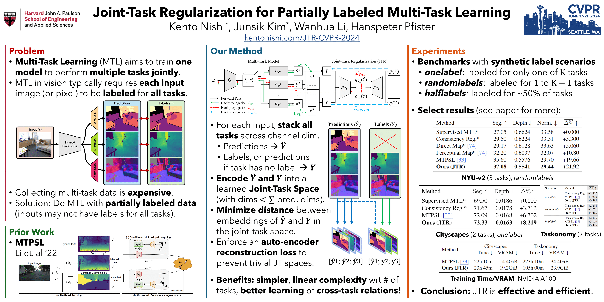

# **[CVPR 2024]** Joint-Task Regularization for Partially Labeled Multi-Task Learning

<a href="https://kentonishi.com/JTR-CVPR-2024/" target="_blank">
  
</a>

## Updates
* **June 2024:** Code released for Cityscapes `onelabel`.
* **May 2024:** Code released for NYUv2 `onelabel` and `randomlabels`.
* **May 2024:** Website updated with the CVPR poster and video.
* **April 2024:** Paper website published at [kentonishi.com/JTR-CVPR-2024](https://kentonishi.com/JTR-CVPR-2024).


## Usage

### Setup
First, download the dataset following the instructions in the [MTPSL repository](https://github.com/VICO-UoE/MTPSL).

### Training JTR

Code for training JTR is stored in the `./code` directory. Some example commands are provided below:

```bash
cd code

# NYUv2 onelabel
python train_nyuv2.py \
  --data-dir [/some/data/dir] \
  --out-dir [/some/output/dir/nyuv2_onelabel] \
  --ssl-type onelabel \
  --label-dir ./data/nyuv2_settings \
  --seg-baseline 25.75 --depth-baseline 0.6511 --norm-baseline 33.73

# NYUv2 randomlabels
python train_nyuv2.py \
  --data-dir [/some/data/dir] \
  --out-dir [/some/output/dir/nyuv2_randomlabels] \
  --ssl-type randomlabels \
  --label-dir ./data/nyuv2_settings \
  --seg-baseline 27.05 --depth-baseline 0.6626 --norm-baseline 33.58

# Cityscapes onelabel
python train_cityscapes.py \
  --data-dir [/some/data/dir] \
  --out-dir [/some/output/dir/cityscapes_onelabel] \
  --label-dir ./data/cityscapes_settings \
  --seg-baseline 69.50 --depth-baseline 0.0186
```

### Patching MTPSL
For convenience, we provide a git patch (`./code/patches/mtpsl.patch`) to modify the MTPSL training code with our dataloader parameters. You can apply the patch as follows:

```bash
git clone git@github.com:VICO-UoE/MTPSL.git
cd MTPSL
git apply /path/to/mtpsl.patch
```

After applying the patch, you can simply run the commands in the [MTPSL repository's README](https://github.com/VICO-UoE/MTPSL/blob/main/README.md).

## Contact
If you have any questions, please contact Kento Nishi and Junsik Kim at [kentonishi@college.harvard.edu](mailto:kentonishi@college.harvard.edu) and [jskim@seas.harvard.edu](jskim@seas.harvard.edu).

## Citation
If you find this code useful, please consider citing our paper:
```bibtex
@misc{nishi2024jointtask,
    title={Joint-Task Regularization for Partially Labeled Multi-Task Learning}, 
    author={Kento Nishi and Junsik Kim and Wanhua Li and Hanspeter Pfister},
    year={2024},
    eprint={2404.01976},
    archivePrefix={arXiv},
    primaryClass={cs.CV}
}
```
